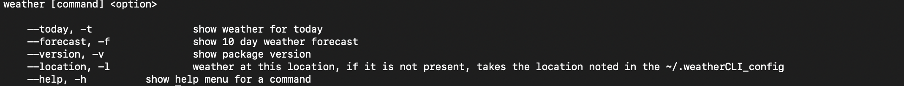

# weatherCLI

## Why

I decided to do this project because I spend my time watching the weather and I thought it might be more fun to develop my own CLI app. Plus I can increase my skills.


## How to use

if you are launching the application for the first time, you will be asked to enter your desired location and unit of temperature measurement (°C or °F) which will be stored in ```~/.weatherCLI_config```
you can then launch the application with the following flags :



## Example


## Configuration

When you run ```weatherCLI``` for the first time, the application asks you to configure the ```.weatherCLI_config``` file. In spite of the update flag two elements cannot still be modified by the CLI (client id and secret client)

#### Change client ID and/or client Secret

For change the ID client and/or the Secret client you have to open the ```~/.weatherCLI_config``` file and modify the corresponding fields. 
